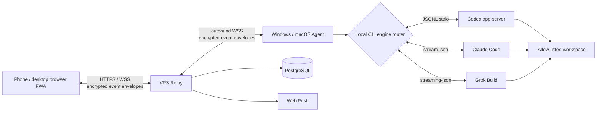

# AnytimeVibe（随码）

[中文 README](README.md) · [Product docs](docs/PRODUCT.md) · [User guide](docs/USER_GUIDE.md)


**Leave the desk. Keep the task moving. Resume your code anywhere.**

AnytimeVibe is a remote AI coding workspace for individual developers and small teams. A phone or desktop browser connects to a Windows or macOS computer, where Codex, Claude Code, or Grok Build executes the selected task. The Web app synchronizes task state, streamed replies, approvals, completion notifications, and conversation history.

It is not a remote desktop. It does not upload project source code or engine credentials to the relay. The desktop Agent detects and runs installed coding CLIs locally; the Relay handles authentication, WebSocket routing, Web Push, and encrypted event storage.

## Product Preview

<video src="docs/media/anytimevibe-promo.mp4" controls width="100%"></video>

| Multi-engine task selection | Native CLI handoff |
| --- | --- |
|  |  |

| Unified multi-engine task stream | Engine permission mapping |
| --- | --- |
|  |  |

## Core Workflow

1. Sign in to the Web PWA from a phone or desktop browser and choose a paired computer and an allowed workspace.
2. Choose Codex, Claude Code, or Grok Build and select the permission mode supported by that engine.
3. The Windows or macOS Agent starts the selected local CLI and streams stages, replies, and task state.
4. For a full terminal workflow, click “Handoff to computer”. The Agent resumes the provider-native session with the matching CLI; refreshing or switching browsers keeps synchronization intact.

## Features

- Multi-user registration, authentication, and per-user host isolation.
- Multiple paired Windows and macOS hosts with custom display names.
- Create tasks with Codex, Claude Code, or Grok Build in allow-listed workspaces.
- Preserve the owning engine, native session ID, permission mode, and streamed output per task.
- Send commands from a phone and hand the same native engine session back to the desktop CLI.
- Synchronized queued, processing, completed, failed, and offline states.
- Web Push notifications for approvals and task completion.
- Engine-aware permissions including Read Only, Full Access, Bypass permissions, and Always approve.
- Multi-browser device authorization without re-pairing the same host for every browser.
- Detection and version reporting for all three engines on every paired host.
- Import of local Claude Code and Grok Build sessions into the unified Web task list.
- Client environment checks, Codex installation guidance, automatic updates, and Windows / macOS installers.
- Manual or post-login task and conversation synchronization.

Current boundary: approval and output capabilities differ between CLIs and are mapped into one task experience. AnytimeVibe does not provide an arbitrary terminal, remote desktop, file browser, or desktop UI automation. The Agent must be online in a logged-in desktop session with at least one supported engine installed and authenticated.

## Supported Coding Engines

| Engine | Local execution | Permission mapping | Sessions and handoff |
| --- | --- | --- | --- |
| Codex | `codex app-server --stdio` | Read Only, Ask for approval, Approve for me, Full Access | Reads Codex threads and hands off with `codex resume` |
| Claude Code | `claude -p --output-format stream-json` | Read-only tools, Accept edits, Bypass permissions | Imports `~/.claude/projects` and hands off with `claude --resume` |
| Grok Build | `grok -p --output-format streaming-json` | Read-only tools, Accept edits, Always approve | Imports Grok sessions and hands off with `grok --resume` |

The task dialog only enables engines detected as ready on the selected host. Claude and Grok models can be overridden with `CLAUDE_MODEL`, `ANTHROPIC_MODEL`, `GROK_MODEL`, or `XAI_MODEL`; otherwise each CLI keeps its local default.

## Architecture



## Technology Stack

| Layer | Technology | Responsibility |
| --- | --- | --- |
| Web PWA | React 19, TypeScript, Vite 6, Service Worker, IndexedDB | Authentication, hosts, tasks, conversations, approvals, diffs, and mobile layout |
| Relay | Node.js, Fastify 5, WebSocket, Zod, Argon2id, Web Push | Authentication, isolation, online routing, encrypted event storage, and notifications |
| Database | PostgreSQL 16 | Accounts, sessions, hosts, pairing records, Push subscriptions, and encrypted event metadata |
| Desktop Agent | Electron 36, WebSocket, electron-updater | Tray app, pairing, three-engine detection, local session import, updates, and process management |
| Multi-engine adapters | Codex app-server, Claude stream-json, Grok streaming-json | Engine selection, permission mapping, streaming events, session resume, interruption, and native CLI handoff |
| Operations | Docker Compose, Caddy 2.8 | Relay, Web, PostgreSQL, HTTPS, and automatic certificate renewal |

## Security Model

- The Relay does not run any coding engine or read project source, command bodies, conversation bodies, or diffs in plaintext.
- Web and Agent messages are encrypted event envelopes; host sync keys are managed by the browser and Agent.
- Browser keys are stored as IndexedDB `CryptoKey` values. A new browser receives an authorization package from the Agent.
- The Agent uses Electron `safeStorage` to protect local tokens, private keys, and sync keys.
- Remote tasks can only access workspaces explicitly configured by the Agent.
- Passwords use Argon2id, and both HTTP APIs and WebSockets enforce rate and payload limits.

## Quick Start

Requirements: Node.js 22+, pnpm 10+, and Git. Docker Engine and Docker Compose are required for the production stack. The Agent host needs at least one authenticated engine: Codex CLI `0.144.x`, Claude Code CLI, or Grok Build CLI.

```bash
git clone https://github.com/demonrain/anytimevibe.git
cd anytimevibe
pnpm install
pnpm typecheck
pnpm test
pnpm build
```

## Docker Deployment

1. Prepare a Linux VPS with a public IP, a DNS name, and TCP ports 80 / 443 open.
2. Copy the environment template and replace every secret:

```bash
cp .env.example .env
```

Configure at least `DOMAIN`, `POSTGRES_PASSWORD`, `SETUP_TOKEN`, `COOKIE_SECRET`, `PUBLIC_ORIGIN`, and the VAPID keys. Set `REGISTRATION_ENABLED` to control public registration and `MAX_USERS` to set the user limit.

Generate Web Push keys:

```bash
pnpm --filter @anytimevibe/relay exec web-push generate-vapid-keys
```

Start the production stack:

```bash
docker compose up -d --build
docker compose ps
docker compose logs -f relay
```

Caddy requests HTTPS certificates for `DOMAIN`. Open `PUBLIC_ORIGIN` in a browser and use `SETUP_TOKEN` to initialize the first administrator space. When public registration is enabled, other users can create accounts.

## Build the Desktop Agent

Windows installer:

```bash
pnpm --filter @anytimevibe/agent package:win
```

macOS DMG / ZIP:

```bash
pnpm --filter @anytimevibe/agent package:mac
```

The macOS package must be built on macOS or GitHub Actions `macos-latest`. Installers are currently unsigned, so Windows may show SmartScreen and macOS may require confirmation in Privacy & Security.

Client download links and update feeds are configured with `WINDOWS_CLIENT_URL`, `MAC_CLIENT_URL`, and `UPDATE_FEED_URL`. See [docs/UPDATE_FEED.md](docs/UPDATE_FEED.md) for the update flow.

## Documentation

- [Product documentation](docs/PRODUCT.md): goals, architecture, data model, and security design.
- [User guide](docs/USER_GUIDE.md): deployment, initialization, pairing, task operations, and troubleshooting.
- [Admin guide](docs/ADMIN.md): multi-user administration and operational boundaries.
- [Capacity assessment](docs/CAPACITY.md): server sizing by registered users and concurrent connections.
- [Update feed](docs/UPDATE_FEED.md): background desktop updates and restart-to-install behavior.

## Star History


See the live repository statistics at [github.com/demonrain/anytimevibe](https://github.com/demonrain/anytimevibe).

## License

This project is released under the [MIT License](LICENSE). Code, documentation, and examples may be used, modified, and redistributed with the copyright notice preserved. Do not imply official endorsement when redistributing the brand name, icon, or promotional assets.

## Contributing

Issues, documentation improvements, and pull requests are welcome. Changes involving encryption, permission boundaries, task execution, or update feeds should include tests and a security impact note.

```bash
pnpm typecheck
pnpm test
pnpm build
```
