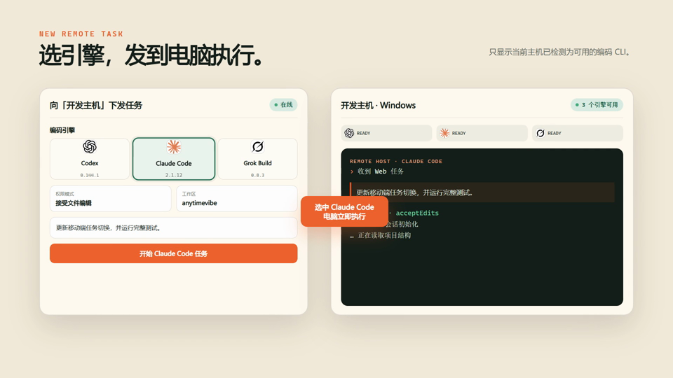
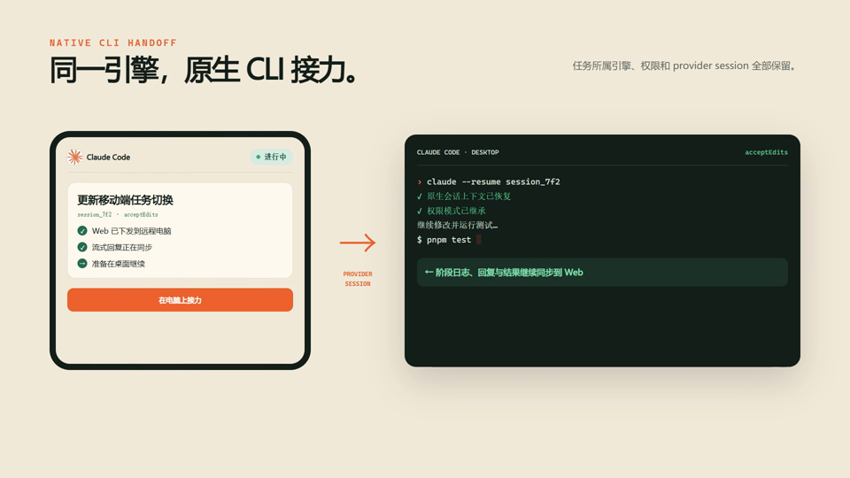
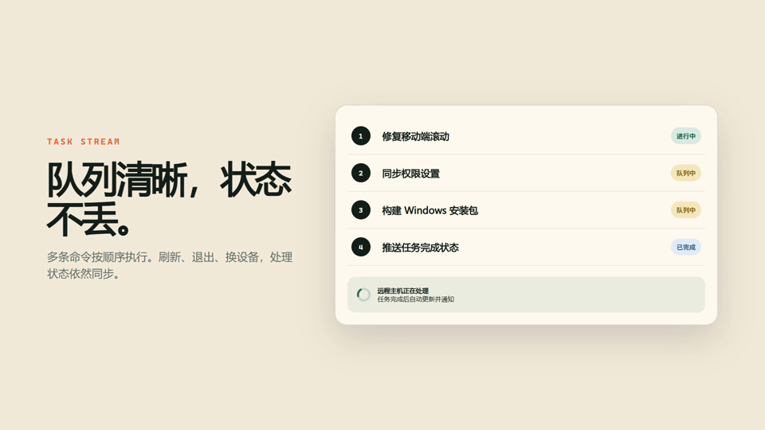
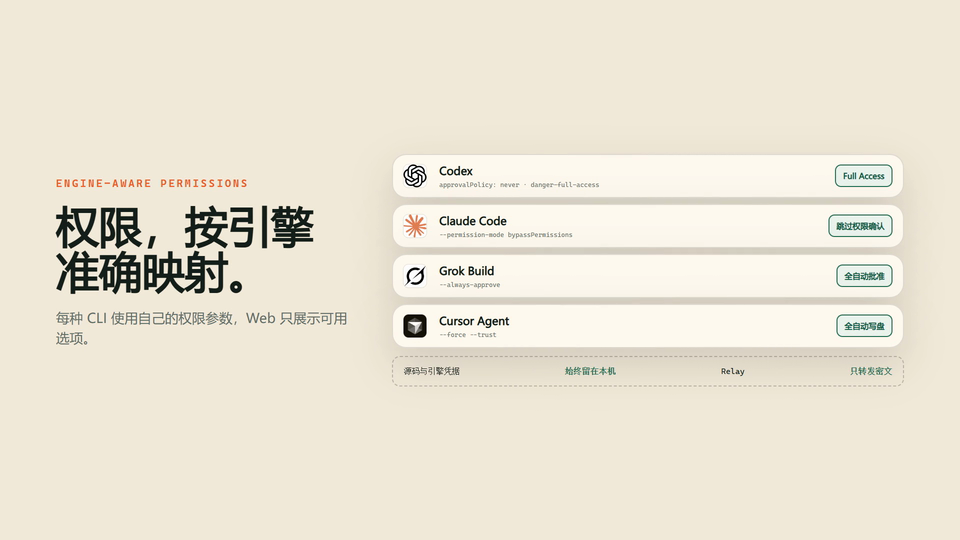
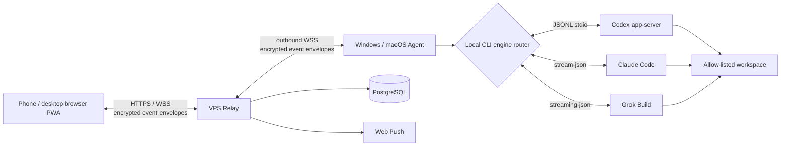

# AnytimeVibe（随码）

[中文 README](README.md) · [Product docs](docs/PRODUCT.md) · [User guide](docs/USER_GUIDE.md)


**Run Codex, Claude Code, or Grok Build on your own machine—and keep the task moving from your phone. Not a remote desktop. Not a cloud that holds your source or API keys.**

## 20-second overview

<p align="center">
  
</p>

<p align="center">
  <a href="docs/media/anytimevibe-promo.webp">WebP animation</a>
  ·
  <a href="docs/media/anytimevibe-promo.mp4">Full MP4 video</a>
  ·
  <a href="https://github.com/demonrain/anytimevibe/releases/latest">Download desktop agent</a>
</p>

<details>
<summary>Play video where supported</summary>

<video src="docs/media/anytimevibe-promo.mp4" poster="docs/media/anytimevibe-promo-poster.jpg" controls width="100%"></video>

</details>

## Try it now

| Step | Action |
| --- | --- |
| 1 | [Download the Windows / macOS Agent](https://github.com/demonrain/anytimevibe/releases/latest), install it, and add allow-listed workspaces |
| 2 | Open the Web PWA, sign in, and enter the pairing code from the agent |
| 3 | Create a task with **Codex / Claude Code / Grok Build**, then follow progress, continue the chat, and approve from your phone |

Self-host the relay via [Docker deployment](#docker-deployment). Local development: [docs/LOCAL_DEV.md](docs/LOCAL_DEV.md).

## Three reasons to use it

1. **Task-native remote, not full desktop control** — stream replies, status, approvals, and diffs without babysitting a remote screen.
2. **Engines stay on your PC** — the Agent runs installed CLIs locally; source, keys, and session files never go to the relay as plaintext.
3. **One workbench for three engines** — each task keeps its engine and native session; filter, hand off, and resume across browsers.

## Why not just SSH, remote desktop, or Tailscale?

| | AnytimeVibe | SSH / terminal | Remote desktop | Tailscale |
| --- | --- | --- | --- | --- |
| Phone UX | Task cards, streaming, approval buttons | Tiny terminal | Full desktop | Connectivity only |
| Code & secrets | Stay local; relay stores encrypted envelopes | Depends on you | Larger GUI attack surface | No task/approval layer |
| Multi-CLI | Codex / Claude / Grok in one list | You switch tools | You open windows | N/A |
| Best for | Continue coding tasks away from the desk | Ops & scripts | Full GUI work | Secure networking |

AnytimeVibe does **not** replace SSH or RDP. Use “Handoff to computer” when you need a full native CLI. It fills the gap between leaving your desk and still driving local AI coding agents.

## Screenshots

| Multi-engine task selection | Native CLI handoff |
| --- | --- |
|  |  |

| Unified multi-engine task stream | Engine permission mapping |
| --- | --- |
|  |  |

## Core workflow

1. Sign in to the Web PWA and choose a paired computer plus an allow-listed workspace.
2. Create a task with Codex, Claude Code, or Grok Build and a matching permission mode.
3. The Agent starts the selected local CLI and streams stages, replies, and status.
4. For a full terminal, hand off to the provider-native session on the computer.

## Features (summary)

- Multi-user isolation, multi-host pairing, workspace allow-lists.
- Three engines, streaming output, permission mapping, native session handoff.
- Task list ordered by last activity; filter by engine.
- Web Push for approvals/completion; multi-browser host-key authorization.
- Client environment detection, install helpers, auto-update.

Boundary: CLI capabilities differ and are mapped into one UX. No arbitrary terminal, remote desktop, or file browser. The Agent must run in a logged-in desktop session with at least one engine installed and signed in.

## Supported Coding Engines

| Engine | Local execution | Permission mapping | Sessions and handoff |
| --- | --- | --- | --- |
| Codex | `codex app-server --stdio` | Read Only, Ask for approval, Approve for me, Full Access | Reads Codex threads and hands off with `codex resume` |
| Claude Code | `claude -p --output-format stream-json` | Read-only tools, Accept edits, Bypass permissions | Imports `~/.claude/projects` and hands off with `claude --resume` |
| Grok Build | `grok -p --output-format streaming-json` | Read-only tools, Accept edits, Always approve | Imports Grok sessions and hands off with `grok --resume` |

The task dialog only enables engines detected as ready on the selected host. Claude and Grok models can be overridden with `CLAUDE_MODEL`, `ANTHROPIC_MODEL`, `GROK_MODEL`, or `XAI_MODEL`; otherwise each CLI keeps its local default.

## Architecture



## Technology Stack

| Layer | Technology | Responsibility |
| --- | --- | --- |
| Web PWA | React 19, TypeScript, Vite 6, Service Worker, IndexedDB | Authentication, hosts, tasks, conversations, approvals, diffs, and mobile layout |
| Relay | Node.js, Fastify 5, WebSocket, Zod, Argon2id, Web Push | Authentication, isolation, online routing, encrypted event storage, and notifications |
| Database | PostgreSQL 16 | Accounts, sessions, hosts, pairing records, Push subscriptions, and encrypted event metadata |
| Desktop Agent | Electron 36, WebSocket, electron-updater | Tray app, pairing, three-engine detection, local session import, updates, and process management |
| Multi-engine adapters | Codex app-server, Claude stream-json, Grok streaming-json | Engine selection, permission mapping, streaming events, session resume, interruption, and native CLI handoff |
| Operations | Docker Compose, Caddy 2.8 | Relay, Web, PostgreSQL, HTTPS, and automatic certificate renewal |

## Security Model

- The Relay does not run any coding engine or read project source, command bodies, conversation bodies, or diffs in plaintext.
- Web and Agent messages are encrypted event envelopes; host sync keys are managed by the browser and Agent.
- Browser keys are stored as IndexedDB `CryptoKey` values. A new browser receives an authorization package from the Agent.
- The Agent uses Electron `safeStorage` to protect local tokens, private keys, and sync keys.
- Remote tasks can only access workspaces explicitly configured by the Agent.
- Passwords use Argon2id, and both HTTP APIs and WebSockets enforce rate and payload limits.

## Quick Start

Requirements: Node.js 22+, pnpm 10+, and Git. Docker Engine and Docker Compose are required for the production stack. The Agent host needs at least one authenticated engine: Codex CLI `0.144.x`, Claude Code CLI, or Grok Build CLI.

```bash
git clone https://github.com/demonrain/anytimevibe.git
cd anytimevibe
pnpm install
pnpm typecheck
pnpm test
pnpm build
```

## Docker Deployment

1. Prepare a Linux VPS with a public IP, a DNS name, and TCP ports 80 / 443 open.
2. Copy the environment template and replace every secret:

```bash
cp .env.example .env
```

Configure at least `DOMAIN`, `POSTGRES_PASSWORD`, `SETUP_TOKEN`, `COOKIE_SECRET`, `PUBLIC_ORIGIN`, and the VAPID keys. Set `REGISTRATION_ENABLED` to control public registration and `MAX_USERS` to set the user limit.

Generate Web Push keys:

```bash
pnpm --filter @anytimevibe/relay exec web-push generate-vapid-keys
```

Start the production stack:

```bash
docker compose up -d --build
docker compose ps
docker compose logs -f relay
```

Caddy requests HTTPS certificates for `DOMAIN`. Open `PUBLIC_ORIGIN` in a browser and use `SETUP_TOKEN` to initialize the first administrator space. When public registration is enabled, other users can create accounts.

## Build the Desktop Agent

Windows installer:

```bash
pnpm --filter @anytimevibe/agent package:win
```

macOS DMG / ZIP:

```bash
pnpm --filter @anytimevibe/agent package:mac
```

The macOS package must be built on macOS or GitHub Actions `macos-latest`. Installers are currently unsigned, so Windows may show SmartScreen and macOS may require confirmation in Privacy & Security.

Client download links and update feeds are configured with `WINDOWS_CLIENT_URL`, `MAC_CLIENT_URL`, and `UPDATE_FEED_URL`. See [docs/UPDATE_FEED.md](docs/UPDATE_FEED.md) for the update flow.

## Documentation

- [Product documentation](docs/PRODUCT.md): goals, architecture, data model, and security design.
- [User guide](docs/USER_GUIDE.md): deployment, initialization, pairing, task operations, and troubleshooting.
- [Admin guide](docs/ADMIN.md): multi-user administration and operational boundaries.
- [Capacity assessment](docs/CAPACITY.md): server sizing by registered users and concurrent connections.
- [Update feed](docs/UPDATE_FEED.md): background desktop updates and restart-to-install behavior.

## Star History

[](https://www.star-history.com/#demonrain/anytimevibe&Date)

Interactive chart: [star-history.com](https://www.star-history.com/#demonrain/anytimevibe&Date) · Repo: [github.com/demonrain/anytimevibe](https://github.com/demonrain/anytimevibe)

See the live repository statistics at [github.com/demonrain/anytimevibe](https://github.com/demonrain/anytimevibe).

## License

This project is released under the [MIT License](LICENSE). Code, documentation, and examples may be used, modified, and redistributed with the copyright notice preserved. Do not imply official endorsement when redistributing the brand name, icon, or promotional assets.

## Contributing

Issues, documentation improvements, and pull requests are welcome. Changes involving encryption, permission boundaries, task execution, or update feeds should include tests and a security impact note.

```bash
pnpm typecheck
pnpm test
pnpm build
```
