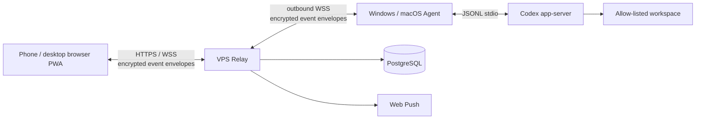

# AnytimeVibe（随码）

[中文 README](README.md) · [Product docs](docs/PRODUCT.md) · [User guide](docs/USER_GUIDE.md)


**Leave the desk. Keep the task moving. Resume your code anywhere.**

AnytimeVibe is a remote Codex workspace for individual developers and small teams. A phone or desktop browser connects to a Windows or macOS computer, where the local Codex CLI executes the task. The Web app synchronizes task state, approvals, completion notifications, and conversation history.

It is not a remote desktop. It does not upload project source code or Codex credentials to the relay. The desktop Agent runs Codex locally; the Relay handles authentication, WebSocket routing, Web Push, and encrypted event storage.

## Product Preview

[](docs/media/anytimevibe-promo.mp4)

Video: [anytimevibe-promo.mp4](docs/media/anytimevibe-promo.mp4). It demonstrates phone-to-PC task dispatch, CLI handoff, queue state synchronization, and permission controls.

| Phone dispatch | Desktop CLI handoff |
| --- | --- |
|  |  |

| Task stream and status | Codex permission control |
| --- | --- |
|  |  |

## Core Workflow

1. Sign in to the Web PWA from a phone or desktop browser and choose a paired computer and an allowed workspace.
2. Send a task from the phone. The Windows or macOS Agent starts or continues the local Codex CLI task.
3. When a full terminal workflow is more convenient, click “Handoff to computer” and run `codex resume` against the same task context.
4. Task progress, completion state, approval requests, and synchronized conversation history return to the Web app. Refreshing or switching browsers does not lose the task state.

## Features

- Multi-user registration, authentication, and per-user host isolation.
- Multiple paired Windows and macOS hosts with custom display names.
- Create, resume, steer, and stop Codex tasks in allow-listed workspaces.
- Send commands from a phone, execute them on the remote computer, and hand the same task back to the desktop CLI.
- Synchronized queued, processing, completed, failed, and offline states.
- Web Push notifications for approvals and task completion.
- Codex permission modes such as Full Access, Workspace Write, and Read Only.
- Multi-browser device authorization without re-pairing the same host for every browser.
- Client environment checks, Codex installation guidance, automatic updates, and Windows / macOS installers.
- Manual or post-login task and conversation synchronization.

Current boundary: while a task is running, the Web app primarily shows its processing state. Full streaming CLI output is handled by the local Agent. AnytimeVibe does not provide an arbitrary terminal, remote desktop, file browser, or Codex desktop UI automation. The Agent must be online in a logged-in desktop session with a working Codex installation.

## Architecture



## Technology Stack

| Layer | Technology | Responsibility |
| --- | --- | --- |
| Web PWA | React 19, TypeScript, Vite 6, Service Worker, IndexedDB | Authentication, hosts, tasks, conversations, approvals, diffs, and mobile layout |
| Relay | Node.js, Fastify 5, WebSocket, Zod, Argon2id, Web Push | Authentication, isolation, online routing, encrypted event storage, and notifications |
| Database | PostgreSQL 16 | Accounts, sessions, hosts, pairing records, Push subscriptions, and encrypted event metadata |
| Desktop Agent | Electron 36, WebSocket, electron-updater | Tray app, pairing, environment checks, updates, and local Codex process management |
| Codex adapter | Codex app-server JSONL stdio | `thread/start`, `thread/resume`, `turn/start`, approvals, and status events |
| Operations | Docker Compose, Caddy 2.8 | Relay, Web, PostgreSQL, HTTPS, and automatic certificate renewal |

## Security Model

- The Relay does not run Codex or read project source, command bodies, conversation bodies, or diffs in plaintext.
- Web and Agent messages are encrypted event envelopes; host sync keys are managed by the browser and Agent.
- Browser keys are stored as IndexedDB `CryptoKey` values. A new browser receives an authorization package from the Agent.
- The Agent uses Electron `safeStorage` to protect local tokens, private keys, and sync keys.
- Remote tasks can only access workspaces explicitly configured by the Agent.
- Passwords use Argon2id, and both HTTP APIs and WebSockets enforce rate and payload limits.

## Quick Start

Requirements: Node.js 22+, pnpm 10+, and Git. Docker Engine and Docker Compose are required for the production stack.

```bash
git clone https://github.com/demonrain/anytimevibe.git
cd anytimevibe
pnpm install
pnpm typecheck
pnpm test
pnpm build
```

### Local test environment (recommended before release)

Full guide: [docs/LOCAL_DEV.md](docs/LOCAL_DEV.md).

```bash
pnpm install
pnpm dev:setup          # .env.local + local Postgres + protocol build
pnpm dev:stack          # Relay + Web
# another terminal:
pnpm dev:agent:local    # Electron → http://127.0.0.1:8787, data under .local/agent-data
```

Open http://127.0.0.1:4173 and use `SETUP_TOKEN` from `.env.local` for first-time admin setup.

Or start processes separately:

```bash
pnpm dev:web
pnpm dev:relay
pnpm dev:agent:local
```

## Docker Deployment

1. Prepare a Linux VPS with a public IP, a DNS name, and TCP ports 80 / 443 open.
2. Copy the environment template and replace every secret:

```bash
cp .env.example .env
```

Configure at least `DOMAIN`, `POSTGRES_PASSWORD`, `SETUP_TOKEN`, `COOKIE_SECRET`, `PUBLIC_ORIGIN`, and the VAPID keys. Set `REGISTRATION_ENABLED` to control public registration and `MAX_USERS` to set the user limit.

Generate Web Push keys:

```bash
pnpm --filter @anytimevibe/relay exec web-push generate-vapid-keys
```

Start the production stack:

```bash
docker compose up -d --build
docker compose ps
docker compose logs -f relay
```

Caddy requests HTTPS certificates for `DOMAIN`. Open `PUBLIC_ORIGIN` in a browser and use `SETUP_TOKEN` to initialize the first administrator space. When public registration is enabled, other users can create accounts.

## Build the Desktop Agent

Windows installer:

```bash
pnpm --filter @anytimevibe/agent package:win
```

macOS DMG / ZIP:

```bash
pnpm --filter @anytimevibe/agent package:mac
```

The macOS package must be built on macOS or GitHub Actions `macos-latest`. Installers are currently unsigned, so Windows may show SmartScreen and macOS may require confirmation in Privacy & Security.

Client download links and update feeds are configured with `WINDOWS_CLIENT_URL`, `MAC_CLIENT_URL`, and `UPDATE_FEED_URL`. See [docs/UPDATE_FEED.md](docs/UPDATE_FEED.md) for the update flow.

## Documentation

- [Product documentation](docs/PRODUCT.md): goals, architecture, data model, and security design.
- [User guide](docs/USER_GUIDE.md): deployment, initialization, pairing, task operations, and troubleshooting.
- [Admin guide](docs/ADMIN.md): multi-user administration and operational boundaries.
- [Capacity assessment](docs/CAPACITY.md): server sizing by registered users and concurrent connections.
- [Update feed](docs/UPDATE_FEED.md): background desktop updates and restart-to-install behavior.
- [Branding](docs/BRANDING.md): product name, icon, slogan, and publishing assets.

## Star History

The chart below reads GitHub data dynamically instead of hard-coding a stale star count:


See the live repository statistics at [github.com/demonrain/anytimevibe](https://github.com/demonrain/anytimevibe).

## License

This project is released under the [MIT License](LICENSE). Code, documentation, and examples may be used, modified, and redistributed with the copyright notice preserved. Do not imply official endorsement when redistributing the brand name, icon, or promotional assets.

## Contributing

Issues, documentation improvements, and pull requests are welcome. Changes involving encryption, permission boundaries, task execution, or update feeds should include tests and a security impact note.

```bash
pnpm typecheck
pnpm test
pnpm build
```
