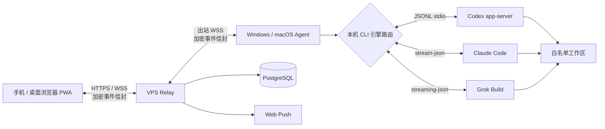

# 随码（AnytimeVibe）

[English](README.en.md) · [产品文档](docs/PRODUCT.md) · [使用手册](docs/USER_GUIDE.md)


**离开电脑，任务不用停。随时续上你的代码。**

随码是一个面向个人开发者和小团队的远程 AI 编程工作台：通过手机或浏览器连接自己的 Windows / macOS 电脑，选择 Codex、Claude Code 或 Grok Build 在远程主机上执行任务，并同步任务状态、流式回复、会话记录、审批和完成通知。

它不是远程桌面，也不会把项目源码或各引擎凭据上传到中继服务。桌面 Agent 在本机检测并调用已安装的编码 CLI，Relay 只负责身份认证、WebSocket 路由、Web Push 和加密事件存储。

## 产品预览

<video src="docs/media/anytimevibe-promo.mp4" controls width="100%"></video>

| 多引擎任务选择 | 原生 CLI 接力 |
| --- | --- |
|  |  |

| 多引擎任务流 | 引擎权限映射 |
| --- | --- |
|  |  |

## 核心工作流

1. 在手机或桌面浏览器登录 Web PWA，选择已配对的电脑和白名单工作区。
2. 新建任务时选择 Codex、Claude Code 或 Grok Build，并使用该引擎对应的权限模式。
3. Windows / macOS Agent 在本机启动选定 CLI，实时同步阶段日志、回复和任务状态。
4. 需要完整终端体验时，点击“电脑接力”，Agent 使用对应引擎的原生会话 ID 恢复任务；刷新或更换浏览器也能继续同步。

## 能做什么

- 多用户注册、登录和用户级主机隔离。
- 配对多台 Windows / macOS 主机，并为主机设置易记名称。
- 在白名单工作区选择 Codex、Claude Code 或 Grok Build 创建任务。
- 每个任务保留所属引擎、原生会话 ID、权限模式和流式输出。
- 手机下发命令，远程电脑执行；电脑端按引擎一键接力到同一原生会话。
- 任务队列、处理中、已完成、失败和离线状态同步。
- Web Push 审批与任务完成通知。
- 根据不同 CLI 映射 Read Only、Full Access、Bypass permissions、Always approve 等权限。
- 多浏览器设备授权，避免每个浏览器重复配对同一主机。
- 客户端检测三种引擎的安装状态和版本，并展示每台主机可用的引擎。
- 导入 Claude Code / Grok Build 本地会话，与 Web 创建的任务统一显示。
- 客户端环境检测、Codex 安装指引、自动更新和 Windows / macOS 安装包。
- 手动同步或登录后自动同步任务记录和会话历史。

当前边界：不同 CLI 的审批与输出能力存在差异，随码会映射为统一任务体验；不提供任意终端、远程桌面、文件浏览器或桌面 UI 自动化。Agent 必须在电脑用户已登录且至少一个受支持引擎已安装并完成登录时在线工作。

## 支持的编码引擎

| 引擎 | 本机执行方式 | 权限映射 | 会话与接力 |
| --- | --- | --- | --- |
| Codex | `codex app-server --stdio` | Read Only、Ask for approval、Approve for me、Full Access | 读取 Codex thread，并通过 `codex resume` 接力 |
| Claude Code | `claude -p --output-format stream-json` | 只读工具、接受文件编辑、跳过权限确认 | 导入 `~/.claude/projects` 会话，并通过 `claude --resume` 接力 |
| Grok Build | `grok -p --output-format streaming-json` | 只读工具、接受文件编辑、全自动批准 | 导入 Grok sessions，并通过 `grok --resume` 接力 |

任务创建页只允许选择当前主机已检测为可用的引擎。Claude / Grok 可以通过 `CLAUDE_MODEL`、`ANTHROPIC_MODEL`、`GROK_MODEL` 或 `XAI_MODEL` 指定模型；未设置时使用对应 CLI 的本机默认配置。

## 系统架构



## 技术栈

| 层 | 技术 | 职责 |
| --- | --- | --- |
| Web PWA | React 19、TypeScript、Vite 6、Service Worker、IndexedDB | 登录、主机、任务、会话、审批、Diff 和移动端布局 |
| Relay 服务 | Node.js、Fastify 5、WebSocket、Zod、Argon2id、Web Push | 认证、用户隔离、在线路由、加密事件存储和通知 |
| 数据库 | PostgreSQL 16 | 账号、会话、主机、配对、Push 订阅和加密事件元数据 |
| 桌面 Agent | Electron 36、WebSocket、electron-updater | 托盘常驻、配对、三引擎检测、本地会话导入、自动更新和进程管理 |
| 多引擎适配 | Codex app-server、Claude stream-json、Grok streaming-json | 引擎选择、权限映射、流式事件、会话恢复、停止任务和原生 CLI 接力 |
| 部署 | Docker Compose、Caddy 2.8 | Relay、Web、PostgreSQL、HTTPS 和证书自动续期 |

## 安全模型

- Relay 不运行任何编码引擎，不读取项目源码、命令正文、对话正文或 Diff 明文。
- Web 与 Agent 之间传输加密事件信封；主机同步密钥由浏览器和 Agent 管理。
- 浏览器密钥保存在 IndexedDB `CryptoKey` 中，新浏览器通过 Agent 授权现有主机密钥。
- Agent 使用 Electron `safeStorage` 保护本机令牌、私钥和同步密钥。
- 远程任务只能访问 Agent 明确配置的工作区，不能通过随码获得任意终端。
- 服务端使用 Argon2id 保存密码，HTTP API 和 WebSocket 都有速率限制和消息大小限制。

## 快速开始

环境要求：Node.js 22+、pnpm 10+、Git；运行服务端还需要 Docker Engine 和 Docker Compose。执行远程任务至少需要在 Agent 主机上安装并登录 Codex CLI `0.144.x`、Claude Code CLI 或 Grok Build CLI 中的一种。

```bash
git clone https://github.com/demonrain/anytimevibe.git
cd anytimevibe
pnpm install
pnpm typecheck
pnpm test
pnpm build
```

## Docker 部署

1. 准备一台带公网 IP 的 Linux VPS、域名，并放行 TCP 80 / 443。
2. 复制环境变量模板并填写强随机值：

```bash
cp .env.example .env
```

至少配置 `DOMAIN`、`POSTGRES_PASSWORD`、`SETUP_TOKEN`、`COOKIE_SECRET`、`PUBLIC_ORIGIN` 和 VAPID 密钥。开放注册由 `REGISTRATION_ENABLED` 控制，用户上限由 `MAX_USERS` 控制。

生成 Web Push 密钥：

```bash
pnpm --filter @anytimevibe/relay exec web-push generate-vapid-keys
```

启动生产服务：

```bash
docker compose up -d --build
docker compose ps
docker compose logs -f relay
```

Caddy 会根据 `DOMAIN` 自动申请 HTTPS 证书。首次打开 `PUBLIC_ORIGIN` 时，使用 `SETUP_TOKEN` 初始化管理员空间；启用开放注册后，其他用户可以自行注册。

## 构建桌面客户端

Windows 安装包：

```bash
pnpm --filter @anytimevibe/agent package:win
```

macOS DMG / ZIP：

```bash
pnpm --filter @anytimevibe/agent package:mac
```

macOS 包需要在 macOS 或 GitHub Actions `macos-latest` 环境构建。当前安装包默认未进行代码签名，Windows 可能显示 SmartScreen 提示，macOS 可能要求用户在“隐私与安全性”中允许打开。

客户端更新源和首页下载链接由 `WINDOWS_CLIENT_URL`、`MAC_CLIENT_URL` 和 `UPDATE_FEED_URL` 配置。更详细的更新源说明见 [docs/UPDATE_FEED.md](docs/UPDATE_FEED.md)。

## 文档导航

- [产品文档](docs/PRODUCT.md)：产品目标、系统架构、数据模型和安全设计。
- [使用手册](docs/USER_GUIDE.md)：部署、初始化、配对、任务操作和故障排查。
- [管理后台](docs/ADMIN.md)：多用户服务的管理能力和运维边界。
- [容量评估](docs/CAPACITY.md)：不同注册用户数和并发连接规模的服务器建议。
- [更新源配置](docs/UPDATE_FEED.md)：桌面客户端后台更新和重启安装流程。

## Star 趋势


也可以直接查看仓库的实时 Star 数：[github.com/demonrain/anytimevibe](https://github.com/demonrain/anytimevibe)。

## 开源协议

本项目采用 [MIT License](LICENSE)。代码、文档和示例可以在保留版权声明的前提下使用、修改和再发布。品牌名称、图标和宣传素材请勿暗示与原作者存在官方背书关系。

## 参与贡献

欢迎提交 Issue、改进文档和 Pull Request。涉及加密协议、权限边界、任务执行和更新源的改动，请同时补充测试与安全影响说明。

```bash
pnpm typecheck
pnpm test
pnpm build
```
