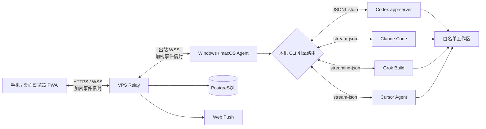

# 随码（AnytimeVibe）

[English](README.en.md) · [产品文档](docs/PRODUCT.md) · [使用手册](docs/USER_GUIDE.md)


**在自己的电脑上跑 Codex / Claude Code / Grok Build / Cursor Agent，用手机随时续上任务——不是远程桌面，也不把源码和凭据交给云端。**

## 35 秒看懂

<p align="center">
  
</p>

<p align="center">
  <a href="docs/media/anytimevibe-promo.webp">WebP 动图</a>
  ·
  <a href="docs/media/anytimevibe-promo.mp4">完整 MP4 视频</a>
  ·
  <a href="https://github.com/demonrain/anytimevibe/releases/latest">下载桌面客户端</a>
</p>

<details>
<summary>在支持的阅读器中播放视频</summary>

<video src="docs/media/anytimevibe-promo.mp4" poster="docs/media/anytimevibe-promo-poster.jpg" controls width="100%"></video>

</details>

## 立即体验

**体验地址：** [https://vibe.demonrain.top/](https://vibe.demonrain.top/)

| 步骤 | 做什么 |
| --- | --- |
| 1 | [下载 Windows / macOS Agent](https://github.com/demonrain/anytimevibe/releases/latest) 并安装，添加白名单工作区 |
| 2 | 打开 [体验站](https://vibe.demonrain.top/) 或自建 Web PWA，登录并输入客户端配对码 |
| 3 | 新建任务时选择 **Codex / Claude Code / Grok Build / Cursor Agent**，在手机上查看进度、继续对话与审批 |

自建中继见下方 [Docker 部署](#docker-部署)。本地开发见 [docs/LOCAL_DEV.md](docs/LOCAL_DEV.md)。

## 三个核心优势

1. **任务式远程，而不是整机远控** — 只同步任务状态、流式回复、审批与 Diff，不必盯着桌面画面。
2. **引擎在你自己的电脑上** — Agent 本机调用已安装的 CLI；源码、API Key、会话文件不上传中继。
3. **四引擎同一工作台** — 每个任务绑定引擎与原生会话，可筛选、接力，刷新浏览器也不丢上下文。

## 为什么不用 SSH、远程桌面或 Tailscale？

| | 随码 | SSH / 终端 | 远程桌面 | Tailscale 组网 |
| --- | --- | --- | --- | --- |
| 手机上的体验 | 任务卡片、流式回复、审批按钮 | 小屏敲终端 | 看整屏桌面、点鼠标 | 只解决网络连通 |
| 代码与凭据 | 留在本机；中继只存密文事件 | 取决于你怎么用 | 画面在远端，风险面更大 | 不负责任务与审批 |
| 多 CLI | Codex / Claude / Grok / Cursor 统一列表 | 自己切工具 | 自己开窗口 | 无 |
| 典型场景 | 通勤续任务、审批、看进度 | 运维与脚本 | 需要完整 GUI 时 | 需要安全组网时 |

随码**不替代** SSH 或 RDP：当你需要完整终端或桌面时，用「电脑接力」回到本机原生 CLI。它补的是「离开工位后仍能驱动本机 AI 编程任务」这一段。

## 产品截图

| 多引擎任务选择 | 原生 CLI 接力 |
| --- | --- |
|  |  |

| 多引擎任务流 | 引擎权限映射 |
| --- | --- |
|  |  |

## 核心工作流

1. 在手机或桌面浏览器登录 Web PWA，选择已配对的电脑和白名单工作区。
2. 新建任务时选择 Codex、Claude Code、Grok Build 或 Cursor Agent，并使用该引擎对应的权限模式。
3. Windows / macOS Agent 在本机启动选定 CLI，实时同步阶段日志、回复和任务状态。
4. 需要完整终端体验时，点击「电脑接力」，Agent 使用对应引擎的原生会话 ID 恢复任务。

## 能做什么（摘要）

- 多用户隔离、多主机配对、工作区白名单。
- 四引擎创建任务、流式输出、权限映射、原生会话接力。
- 任务列表按最后活动时间排序；可按引擎筛选。
- Web Push 审批 / 完成通知；多浏览器授权同一主机密钥。
- 客户端环境检测、引擎安装指引、自动更新。

当前边界：各 CLI 能力存在差异，产品会映射为统一任务体验；不提供任意终端、远程桌面或文件浏览器。Agent 需在用户已登录的桌面会话中运行，且至少一种引擎已安装并登录。

## 支持的编码引擎

| 引擎 | 本机执行方式 | 权限映射 | 会话与接力 |
| --- | --- | --- | --- |
| Codex | `codex app-server --stdio` | Read Only、Ask for approval、Approve for me、Full Access | 读取 Codex thread，并通过 `codex resume` 接力 |
| Claude Code | `claude -p --output-format stream-json` | 只读工具、接受文件编辑、跳过权限确认 | 导入 `~/.claude/projects` 会话，并通过 `claude --resume` 接力 |
| Grok Build | `grok -p --output-format streaming-json` | 只读工具、接受文件编辑、全自动批准 | 导入 Grok sessions，并通过 `grok --resume` 接力 |
| Cursor Agent | `agent -p --output-format stream-json --stream-partial-output` | 仅提议、允许改文件、全自动写盘 | 通过 `--workspace` 绑定工作区，并通过 `agent --resume` 接力 |

任务创建页只允许选择当前主机已检测为可用的引擎。Claude / Grok / Cursor 可以通过 `CLAUDE_MODEL`、`ANTHROPIC_MODEL`、`GROK_MODEL`、`XAI_MODEL` 或 `CURSOR_MODEL` 指定模型；未设置时使用对应 CLI 的本机默认配置（Cursor 默认为 Composer 2.5）。Cursor 还支持按模型选择 Effort，以及部分模型的 Fast 模式；二进制可通过 `CURSOR_COMMAND` / `CURSOR_AGENT_COMMAND` 覆盖（需为 Cursor Agent CLI，而非 Grok 的同名 `agent`）。

## 系统架构



## 技术栈

| 层 | 技术 | 职责 |
| --- | --- | --- |
| Web PWA | React 19、TypeScript、Vite 6、Service Worker、IndexedDB | 登录、主机、任务、会话、审批、Diff 和移动端布局 |
| Relay 服务 | Node.js、Fastify 5、WebSocket、Zod、Argon2id、Web Push | 认证、用户隔离、在线路由、加密事件存储和通知 |
| 数据库 | PostgreSQL 16 | 账号、会话、主机、配对、Push 订阅和加密事件元数据 |
| 桌面 Agent | Electron 36、WebSocket、electron-updater | 托盘常驻、配对、四引擎检测、本地会话导入、自动更新和进程管理 |
| 多引擎适配 | Codex app-server、Claude stream-json、Grok streaming-json、Cursor stream-json | 引擎选择、权限映射、流式事件、会话恢复、停止任务和原生 CLI 接力 |
| 部署 | Docker Compose、Caddy 2.8 | Relay、Web、PostgreSQL、HTTPS 和证书自动续期 |

## 安全模型

- Relay 不运行任何编码引擎，不读取项目源码、命令正文、对话正文或 Diff 明文。
- Web 与 Agent 之间传输加密事件信封；主机同步密钥由浏览器和 Agent 管理。
- 浏览器密钥保存在 IndexedDB `CryptoKey` 中，新浏览器通过 Agent 授权现有主机密钥。
- Agent 使用 Electron `safeStorage` 保护本机令牌、私钥和同步密钥。
- 远程任务只能访问 Agent 明确配置的工作区，不能通过随码获得任意终端。
- 服务端使用 Argon2id 保存密码，HTTP API 和 WebSocket 都有速率限制和消息大小限制。

## 快速开始

环境要求：Node.js 22+、pnpm 10+、Git；运行服务端还需要 Docker Engine 和 Docker Compose。执行远程任务至少需要在 Agent 主机上安装并登录 Codex CLI `0.144.x`、Claude Code CLI、Grok Build CLI 或 Cursor Agent CLI（`agent` / `cursor-agent`，可用 `agent login` 登录）中的一种。

```bash
git clone https://github.com/demonrain/anytimevibe.git
cd anytimevibe
pnpm install
pnpm typecheck
pnpm test
pnpm build
```

## Docker 部署

1. 准备一台带公网 IP 的 Linux VPS、域名，并放行 TCP 80 / 443。
2. 复制环境变量模板并填写强随机值：

```bash
cp .env.example .env
```

至少配置 `DOMAIN`、`POSTGRES_PASSWORD`、`SETUP_TOKEN`、`COOKIE_SECRET`、`PUBLIC_ORIGIN` 和 VAPID 密钥。开放注册由 `REGISTRATION_ENABLED` 控制，用户上限由 `MAX_USERS` 控制。

生成 Web Push 密钥：

```bash
pnpm --filter @anytimevibe/relay exec web-push generate-vapid-keys
```

启动生产服务：

```bash
docker compose up -d --build
docker compose ps
docker compose logs -f relay
```

Caddy 会根据 `DOMAIN` 自动申请 HTTPS 证书。首次打开 `PUBLIC_ORIGIN` 时，使用 `SETUP_TOKEN` 初始化管理员空间；启用开放注册后，其他用户可以自行注册。

## 构建桌面客户端

Windows 安装包：

```bash
pnpm --filter @anytimevibe/agent package:win
```

macOS DMG / ZIP：

```bash
pnpm --filter @anytimevibe/agent package:mac
```

macOS 包需要在 macOS 或 GitHub Actions `macos-latest` 环境构建。当前安装包默认未进行代码签名，Windows 可能显示 SmartScreen 提示，macOS 可能要求用户在“隐私与安全性”中允许打开。

客户端更新源和首页下载链接由 `WINDOWS_CLIENT_URL`、`MAC_CLIENT_URL` 和 `UPDATE_FEED_URL` 配置。更详细的更新源说明见 [docs/UPDATE_FEED.md](docs/UPDATE_FEED.md)。

## 文档导航

- [产品文档](docs/PRODUCT.md)：产品目标、系统架构、数据模型和安全设计。
- [使用手册](docs/USER_GUIDE.md)：部署、初始化、配对、任务操作和故障排查。
- [管理后台](docs/ADMIN.md)：多用户服务的管理能力和运维边界。
- [容量评估](docs/CAPACITY.md)：不同注册用户数和并发连接规模的服务器建议。
- [更新源配置](docs/UPDATE_FEED.md)：桌面客户端后台更新和重启安装流程。

## Star History

<a href="https://www.star-history.com/?repos=demonrain%2Fanytimevibe&type=date&legend=top-left">
 <picture>
   <source media="(prefers-color-scheme: dark)" srcset="https://api.star-history.com/chart?repos=demonrain/anytimevibe&type=date&theme=dark&legend=top-left&sealed_token=fP5ilEUaMkQn14aKOspqXOZGuK1gM92PAAz5e0Qgz3Z8cYHG65NUTd_uAsQ1cm2Th0JFhEjoSa7dNNFZg4iq2IVo8RWPpMwYlkpo_dbfszrBe3qHuXwpXg" />
   <source media="(prefers-color-scheme: light)" srcset="https://api.star-history.com/chart?repos=demonrain/anytimevibe&type=date&legend=top-left&sealed_token=fP5ilEUaMkQn14aKOspqXOZGuK1gM92PAAz5e0Qgz3Z8cYHG65NUTd_uAsQ1cm2Th0JFhEjoSa7dNNFZg4iq2IVo8RWPpMwYlkpo_dbfszrBe3qHuXwpXg" />
   
 </picture>
</a>

## 开源协议

本项目采用 [MIT License](LICENSE)。代码、文档和示例可以在保留版权声明的前提下使用、修改和再发布。品牌名称、图标和宣传素材请勿暗示与原作者存在官方背书关系。

## 参与贡献

欢迎提交 Issue、改进文档和 Pull Request。涉及加密协议、权限边界、任务执行和更新源的改动，请同时补充测试与安全影响说明。

```bash
pnpm typecheck
pnpm test
pnpm build
```

## 友链 & 支持

- **社区**：[LINUX DO](https://linux.do/) —— 真诚、友善、专业的技术交流社区

## 交流群

加入 QQ 群「随码 AnytimeVibe 交流群」：

<a target="_blank" href="https://qm.qq.com/cgi-bin/qm/qr?k=r-97SUcHdisn_wz-4voLVgmXo1rGDfJH&jump_from=webapi&authKey=4NAmjiuC7S5tGVdLDSz8JwDKQQoKkCJTn/oZZKKchOCIEh4PQGAgSWaQw3SyZAti"></a>
