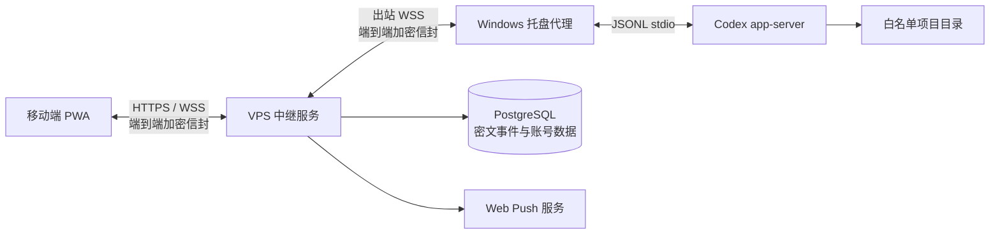

# 随码产品文档

> 2026-07-11 更新：产品已支持开放注册、多用户数据隔离、客户端环境检测、macOS Agent、客户端自定义名称、统一产品图标、紧凑控制面板与服务端可配置自动更新源。容量与公开服务边界以 [多用户容量评估](CAPACITY.md) 为准。

> 任务执行策略更新：Web 端不再同步 Codex 流式输出和实时 Diff，只显示处理中状态、审批请求与完成状态。完整对话通过手动同步或登录后的自动同步获取。

> 多浏览器授权更新：Agent 使用现有主机同步密钥为每个新浏览器生成一次性 ECDH 加密授权包，不再通过重新配对轮换主机密钥。多个浏览器可同时解密同一主机的历史与后续事件。

- 文档版本：`v0.3`
- 产品状态：MVP 已实现
- 更新日期：2026-07-11
- 中文产品名：随码
- 工程 / 英文代号：AnytimeVibe
- 品牌 slogan 详见 [BRANDING.md](BRANDING.md)

## 1. 产品概述

**随码**是一个面向个人开发者的远程 Codex 工作台。主 slogan：**离开电脑，任务不用停。** 副 slogan：**随时续上你的代码。**

用户通过手机或桌面浏览器中的 PWA，连接自己保持在线的 Windows 或 macOS 电脑，在离开电脑后继续创建、查看和控制 Codex 编程任务。

产品不提供传统远程桌面，也不把项目源码复制到云端。随码桌面代理在用户电脑上调用本机 Codex CLI，VPS 中继只负责身份验证、在线路由、Web Push 和端到端加密事件的存储。

### 1.1 产品定位

- 为个人开发者提供“随时继续 Codex 任务”的移动入口。
- 将 Codex 的线程、状态、Diff 和审批转换为适合移动端操作的界面。
- 在不公开远程电脑端口、不上传 Codex 凭据的前提下实现公网访问。
- 用任务式体验替代手机上的完整 IDE 或远程桌面。

### 1.2 核心价值

- 连续性：离开电脑后仍可继续当前任务和对话。
- 可控性：命令执行和文件修改审批可以在手机上完成。
- 可见性：查看任务状态、同步对话与统一 Diff。
- 安全性：只允许访问电脑端配置的白名单工作区，业务内容端到端加密。

## 2. 用户与使用场景

### 2.1 目标用户

首版面向单用户个人开发者，典型特征如下：

- 日常使用 Codex CLI 进行代码编写、调试或重构。
- 有一台长期在线或可远程唤醒的 Windows 或 macOS 开发电脑。
- 希望在通勤、会议间隙或离开工位时继续处理任务。
- 能自行部署一台带域名和 HTTPS 的 VPS，或由技术人员代为部署。

### 2.2 典型场景

- 离开工位前已启动重构任务，手机上查看进度并补充要求。
- Codex 因命令或写文件请求审批，用户通过 Push 通知进入 PWA 完成审批。
- 在外部临时发现问题，选择已有项目并创建修复任务。
- 电脑暂时离线，用户查看此前已同步的任务和对话记录。
- 查看任务产生的 Diff，判断是否需要继续修改或回到电脑详细检查。

## 3. 产品目标与边界

### 3.1 MVP 目标

- 用户可以使用普通用户名和密码登录个人空间。
- 用户可以将一台或多台 Windows / macOS 主机与 PWA 配对，并为每台客户端设置易记名称。
- 用户可以在白名单工作区中创建 Codex 任务。
- 用户可以查看流式回复、继续任务、追加方向或停止任务。
- 用户可以处理命令执行和文件修改审批。
- 用户可以查看任务产生的统一 Diff。
- 用户可以在主机离线时查看已同步的加密历史。
- 用户可以接收待审批和任务完成 Web Push。

### 3.2 MVP 非目标

- 不提供任意交互式终端。
- 不提供完整文件浏览器或远程文件编辑器。
- 不提供桌面画面、鼠标和键盘远程控制。
- 不自动操控 Codex 桌面端 UI。
- 不支持团队成员、角色权限、共享项目或审计后台。
- 不支持 Claude Code 等其他编码 Agent。
- 不保证远程电脑关机或 Windows 用户未登录时可执行任务。

## 4. 系统架构

### 4.1 PWA

- React + Vite 实现，可安装到手机主屏幕。
- 提供登录、主机、任务、对话、审批、Diff 和设置界面。
- 使用 IndexedDB 保存不可导出的同步密钥 `CryptoKey`。
- 通过 Service Worker 接收 Web Push。

### 4.2 VPS 中继

- Fastify 提供 HTTP API 和 WebSocket 长连接。
- PostgreSQL 保存账号、会话、主机、配对记录、Push 订阅和密文事件。
- 不解析 Codex 对话、命令、Diff 或项目源码。
- Caddy 负责 HTTPS、WSS 和证书自动续期。

### 4.3 Windows 代理

- Electron 托盘程序，随当前 Windows 用户登录启动。
- 使用 Electron `safeStorage` 保护代理令牌、私钥和同步密钥。
- 管理允许远程操作的工作区白名单。
- 启动并管理 `codex app-server --stdio`。
- 将 Codex 协议事件转换为产品层事件。

### 4.4 Codex 适配层

MVP 针对 Codex CLI `0.144.x`，使用以下非实验协议方法子集：

- 初始化：`initialize`、`initialized`。
- 线程：`thread/start`、`thread/list`、`thread/read`、`thread/resume`。
- 回合：`turn/start`、`turn/steer`、`turn/interrupt`。
- 事件：消息增量、回合完成、Diff 更新和审批请求。

代理检测到不兼容版本时停止接收远程任务，并在托盘窗口显示升级提示。

## 5. 功能设计

### 5.1 账号初始化与登录

- 服务首次启动时显示初始化页。
- 用户输入服务端配置的 `SETUP_TOKEN`，创建唯一账号和密码。
- 密码使用 Argon2id 保存。
- 登录成功后使用可撤销的服务端会话 Cookie。
- 首版没有自助找回密码和 Passkey。

### 5.2 主机配对

1. Windows 代理生成六位短期配对码和 P-256 公钥。
2. 已登录用户在 PWA 输入配对码并确认主机信息。
3. PWA 生成同步密钥，通过 ECDH 和 HKDF 派生的配对密钥进行包装。
4. 中继创建主机记录和短期代理令牌。
5. 代理取得包装后的同步密钥，保存凭据并建立 WSS 长连接。

配对码有效期为十分钟。代理令牌只以服务端加密形式短暂保存在配对记录中，被代理读取后立即清除。

### 5.2.1 客户端名称

- Agent 控制面板可设置「客户端名称」，默认使用本机主机名。
- 配对时将该名称写入主机记录；Agent 在线时也会通过主机状态事件同步名称。
- Web 主机列表支持重命名，便于用户在多台电脑之间记忆与区分。

### 5.2.2 客户端自动更新

- Agent 从中继 `/api/agent/config` 读取 `UPDATE_FEED_URL`。
- 启动时与每 6 小时自动检查；控制面板可将状态与「检查更新」并排展示。
- 下载完成后提示「重启并更新」。服务端配置详见 [UPDATE_FEED.md](UPDATE_FEED.md)。

### 5.3 工作区白名单

- 工作区必须在 Windows 代理端通过系统目录选择器添加。
- PWA 不能自行输入或扩展允许访问的磁盘根目录。
- 每次创建任务时，代理都会执行规范化路径和父子路径校验。
- 允许在白名单目录本身及其子目录中执行任务。

### 5.4 任务与对话

一个产品任务对应一台主机、一个工作区和一个 Codex 线程。

- 新任务：创建 Codex 线程并发送第一条用户指令。
- 继续任务：对空闲线程发起新回合。
- 追加方向：使用 `turn/steer` 向正在运行的回合追加指令。
- 停止任务：使用 `turn/interrupt` 中断指定回合。
- 历史同步：代理读取 Codex 线程并发布加密线程快照。

### 5.5 审批

- 命令执行审批支持“允许一次”“拒绝”和“取消”。
- 文件修改审批支持“允许一次”“拒绝”和“取消”。
- 额外权限和结构化补充问题在 MVP 中只支持取消，不提供复杂表单回答。
- 审批已经由其他客户端处理或回合结束后，审批卡片自动失效。
- MVP 不提供“永久允许”或远程修改 Codex 安全策略。

### 5.6 Diff

- 使用 Codex 的 `turn/diff/updated` 事件展示最新统一 Diff。
- 移动端按新增、删除和区块标题进行语法着色。
- MVP 不支持在 Diff 中选择性应用、撤销或编辑代码。

### 5.7 离线历史

- 代理发布的持久化事件以 AES-256-GCM 密文存入 PostgreSQL。
- PWA 按主机和序列号增量拉取密文并在本地归并任务状态。
- 主机离线时 PWA 为只读状态，不会排队保存待执行命令。
- 主机重新连接后会重新同步 Codex 线程，修复断线期间的状态差异。

### 5.8 Web Push

- 待审批：发送“远程任务需要处理”的通用通知。
- 任务完成：发送“远程任务已完成”的通用通知。
- 通知正文不包含命令、代码、项目名、Diff 或对话正文。

## 6. 信息架构

### 6.1 登录与初始化页

- 品牌与安全说明。
- 初始化令牌、用户名和密码表单，或普通登录表单。

### 6.2 主工作台

- 顶栏：产品入口、通知开关、账号退出。
- 主机栏：主机列表、在线状态和新增配对入口。
- 任务栏：任务状态、最近消息、工作区和待审批数量。
- 对话区：消息、审批、Diff、继续输入和停止操作。

### 6.3 桌面代理面板（Windows / macOS）

- 紧凑控制面板：无 File / Edit / View 菜单，尽量避免页面滚动。
- 代理、Codex 和中继连接状态。
- 中继服务器地址（默认 `https://vibe.demonrain.top`）与生成配对码、保存同一行。
- 客户端自定义名称。
- 本机环境检测、自动更新状态与检查更新。
- 工作区白名单与任务接力（可折叠）。
- 统一产品图标与中文品牌「随码」用于窗口、托盘、安装包展示名与 Web / PWA。
- 托盘菜单中的打开、添加目录、重连和退出操作。

## 7. 状态与异常

### 7.1 主机状态

- `unconfigured`：尚未配置中继地址。
- `pairing`：等待 PWA 确认配对。
- `connecting`：正在建立 WSS 或启动 Codex。
- `online`：可以接收任务。
- `offline`：连接中断或 Codex app-server 异常。
- `incompatible`：Codex CLI 版本不受支持。

### 7.2 任务状态

任务状态以 Codex 线程和回合返回值为准，界面至少区分运行中、完成、失败和空闲。断线后不依赖本地推测，重新读取线程快照进行校正。

### 7.3 消息一致性

- 每条加密信封包含 UUID 消息 ID、主机 ID 和单调递增序列号。
- 中继对同一主机的序列号和消息 ID建立唯一约束。
- 创建回合时使用 Codex `clientUserMessageId` 避免重复提交。
- WebSocket 重连后使用同步游标拉取遗漏事件。

## 8. 安全与隐私

### 8.1 加密

- 配对：P-256 ECDH + HKDF-SHA-256。
- 内容：AES-256-GCM。
- 传输：HTTPS 和 WSS。
- 浏览器密钥：IndexedDB 中不可导出的 `CryptoKey`。
- Windows 密钥：Electron `safeStorage`。

### 8.2 中继可见信息

中继可以看到账号、主机标识、在线状态、时间、消息长度和通知类别等路由元数据，但不能解密任务指令、对话、命令、Diff 或线程快照。

### 8.3 访问控制

- 单用户账号只能读取和控制归属自己的主机。
- Agent 使用独立 Bearer 令牌连接 WSS，令牌不放入 URL。
- 生产环境校验浏览器请求 Origin。
- 登录、配对和接口请求执行速率限制。
- 撤销主机时关闭实时连接并删除服务器上的密文事件。

### 8.4 威胁边界

- VPS 被读取时，攻击者不应获得业务内容明文或 Codex 凭据。
- PWA 账号失陷时，攻击者仍受到工作区白名单和 Codex 审批策略限制，但可以控制已配对的在线主机，因此密码和会话必须妥善保护。
- 浏览器本身被注入恶意脚本时，当前会话中的解密内容可能暴露；生产环境不得加载不受信任的第三方脚本。
- Windows 主机被攻陷时，本地项目、Codex 凭据和代理密钥均可能暴露，此风险不由中继加密解决。

## 9. 数据与保留策略

### 9.1 服务端数据

- 用户和 Argon2id 密码哈希。
- 可撤销登录会话。
- 主机、配对和公钥元数据。
- 端到端加密同步事件。
- Web Push 订阅。

### 9.2 本地数据

- Windows：中继地址、白名单目录、加密后的密钥和主机令牌、事件序列号。
- 浏览器：主机同步密钥、同步游标、PWA 缓存。
- Codex：线程和会话历史继续由本机 `CODEX_HOME` 管理。

### 9.3 删除行为

- 删除主机后，中继撤销主机令牌、断开连接并删除该主机的密文同步记录。
- 卸载 Windows 代理不会自动删除 Codex 本地历史。
- 清除浏览器站点数据会删除本浏览器的同步密钥。

## 10. 非功能要求

- 移动端首屏适配宽度不低于 320px。
- 主机在线时，正常网络下流式事件应在数秒内显示。
- WebSocket 断线后自动重连，并通过同步游标恢复状态。
- 中继日志不得写入解密后的业务内容、密码或主机令牌。
- 生产部署必须使用 HTTPS/WSS。
- 单条 WebSocket 消息上限为 2 MiB。
- MVP 单次线程列表同步上限为最近 100 个线程。

## 11. 部署与兼容性

- 服务端：Docker Compose、PostgreSQL 16、Caddy 2.8。
- 随码桌面代理：Electron 36，x64 NSIS 安装包，当前未进行代码签名。
- Codex：仅支持 `codex-cli 0.144.x`。
- 浏览器：优先支持 Android Chrome 和安装到主屏幕的 iOS Safari PWA。
- iOS Web Push 需要将 PWA 添加到主屏幕后使用。

## 12. 验收标准

- 首次部署可以使用设置令牌创建账号并登录。
- Windows 代理可以生成配对码，PWA 可以完成密钥交换和主机绑定。
- 代理端没有添加工作区时，PWA 无法创建任务。
- 在线主机可以创建任务并实时显示 Codex 回复。
- 命令和文件审批可以从 PWA 返回给 Codex。
- 任务可以追加指令或停止。
- Diff 可以在移动端查看。
- 主机离线时历史可读、输入不可提交。
- 中继数据库和日志中不存在任务、代码、命令和对话明文。
- 重新连接后不会重复创建已经提交的回合。

## 13. 当前限制与后续方向

### 13.1 当前限制

- 仅单用户，没有密码找回流程。
- 代理需要 Windows 用户已经登录。
- Codex app-server 整体仍属于实验性产品入口，升级前需要做协议兼容测试。
- 超长线程通过完整 `thread/read` 读取，尚未采用实验性分页接口。
- 清除浏览器站点数据后，离线密文无法在该浏览器中直接恢复；主机重新在线并重新配对后可以重新同步当前 Codex 历史。
- 安装包未签名，Windows SmartScreen 可能提示风险。

### 13.2 后续路线

- Passkey、会话管理和密码重置。
- 加密密钥导出、恢复与多移动设备授权。
- macOS 和 Linux 代理。
- 更完整的结构化用户问题回答。
- 文件只读浏览、日志过滤和更强 Diff 导航。
- 多用户团队、主机共享、审计和角色权限。
- Codex 版本自动兼容测试及多版本适配器。
